# Customer Segmentation
    
  
**Notebooks:** [Customers Segmentation](./02_Customer_Segmentation.ipynb)  
**Google Colab:**   
  
## Overview Customer segmentation
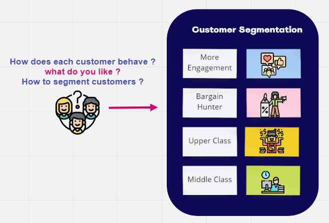  
Understanding customer behaviour would help seller or business to have a strong relationship with customers and result in new sales. Once the seller know how the customers decision process and action when purchasing goods and services, the seller can be more focus on the marketing efforts for current products and new product launches.  
  
To understand their behaviour, we can use customer segmentation. This technique will divide customers into several groups based on their characteristics.  
RFM as this method will use customer behavior such as how much the customer’s spending on the products, how often the customer buy the product, and how long it is since the last purchase the products.  
  
## Dataset   
Supermarket dataset contains 956K rows of sales transactions at sales-item level.  
The dataset received is just a part of Dunhumbly public dataset which is way more bigger. There seems to be historical data from only 2 stores from year 2006 to 2008.  
  
  
  
# Step Customer segmentation (In the case of customers who purchase more than once)  
## 1. Install and import library Dependencies**  
## 2. Load Data (Supermarket dataset)**  
  
## 3. Prepare Customer Single View**  
**Features**  
* `Total_visit` : total distinct transactions over all 'active' , representing *Frequency* in RFM analysis.  
* `Ticket_size` : total spending over all transactions, representing *Monetary* in RFM analysis.  
* `TotalSpend` : total spending over all 'active', representing *Monetary* in RFM analysis.  
* `TotalSKUs` : SKU code identifies the exact product variant you are looking for., representing *Product*.
* `LastDate` : duration in days from the last transaction, representing *Recency* in RFM analysis.  
* `FirstDate` : duration in days from the first transaction, representing *Tenure* in RFM analysis.  
* `ToTalQUANTITY` : total spending over all 'active', representing *Quantity*., representing *Quantity*.  
* `recency` : the range from the last day that the customer arrived with the current day, representing *Recency* in RFM analysis.   
* `Total_days` : the ranges from the last day that the customer arrived and how far apart the last day the customer arrived., representing *Tenure*.  
* `'ToTalQUANTITY_TotalVisits'` : average quantity that a customer purchases each time, representing *Quantity*.  
* `'Totaldays_TotalVisits'` : the average customer days are derived from the total days that the customer arrives., representing *Tenure*.  
* `'Time_be_member'` : See how long this customer has been a customer., representing *Tenure*.  
* `'Conversion_rate'` : percentage of visitors to your channel that complete a desired goal (a conversion) out of the total number of visitors., representing *conversion*.    
* `'diff'` : diffenrence of 'ToTalQUANTITY_TotalVisits' and 'TotalSKUs_TotalVisits'., representing *Quantity*.  
  
**Explore data**
1. Correlation Feature  

    
  
  
  
2. Proportion of customers who use the service more than once and customers who use the service only once.  

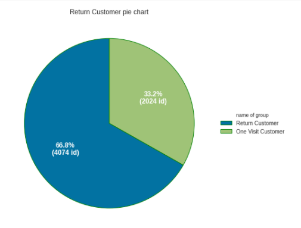  
  
  
  
## 4. Generate Customer Single View  
Before coming to this step data is Basket id level, item id can't be used for clustering segmentation, need to do customer single view as 1 record 1 customer use pycaret to setup environment with ignore_features ignore feature.  
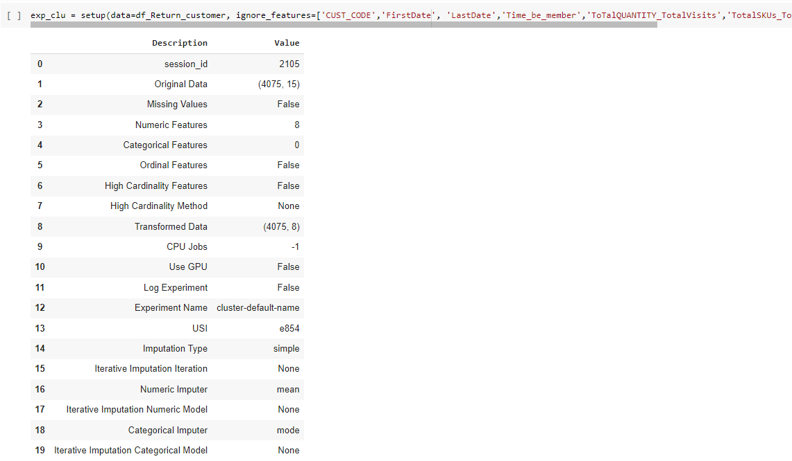  
  
  
  
## 5. Customer segmentation  
1. compare model performance  
From running to compare the models, it was found that the model with good performance was SC and Kmeans.  
  
  
  
  
  
2. Use Spectral Clustering  
The first model to run was sc. After the Plot PCA Run sc model, there was no difference between the groups.  
**therefore choose to use Kmeans**  
    
  
  
  
  
3. Use KMeans Clustering  
The first model to run was Kmeans. After the Plot PCA Run kmeans model, it was found that the differences were clearly visible between the groups.  
  
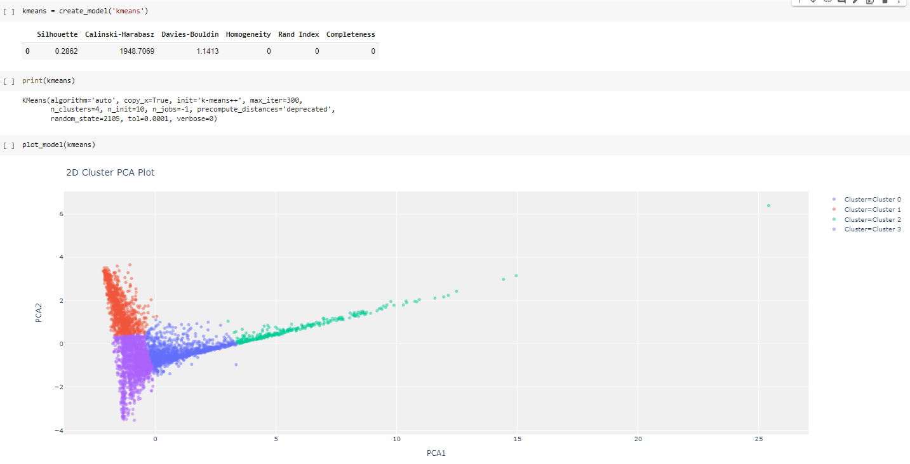  

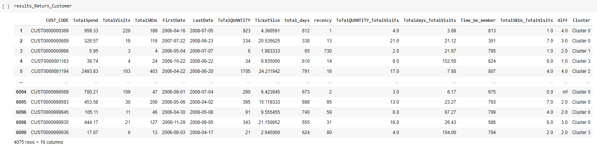  
  
**Elbow plot of Kmeans  and Silhouette plot of Kmeans**  
**Elbow plot of Kmeans**  
This is probably the most well-known method for determining the optimal number of clusters. It is also a bit naive in its approach.
Calculate the Within-Cluster-Sum of Squared Errors (WSS) for different values of k, and choose the k for which WSS becomes first starts to diminish. In the plot of WSS-versus-k, this is visible as an elbow.  
  
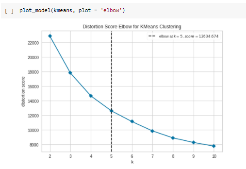  
  
  
  
**Silhouette plot of Kmeans**  
The silhouette value measures how similar a point is to its own cluster (cohesion) compared to other clusters (separation).  
The range of the Silhouette value is between +1 and -1. A high value is desirable and indicates that the point is placed in the correct cluster. If many points have a negative Silhouette value, it may indicate that we have created too many or too few clusters.  
  
  
    
  
  
## 6.Interpret results and plan for actions  
  
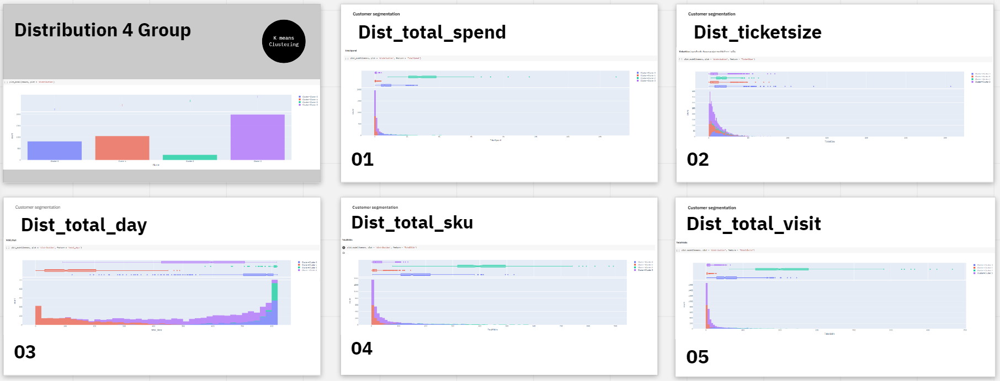  
  
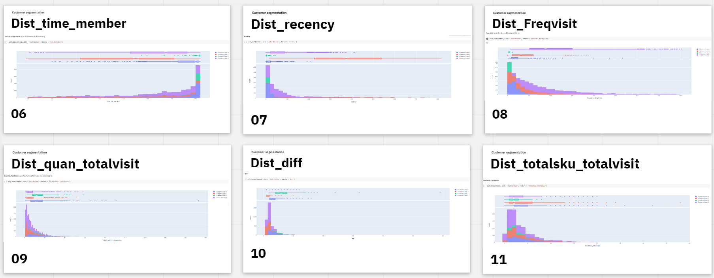  
  
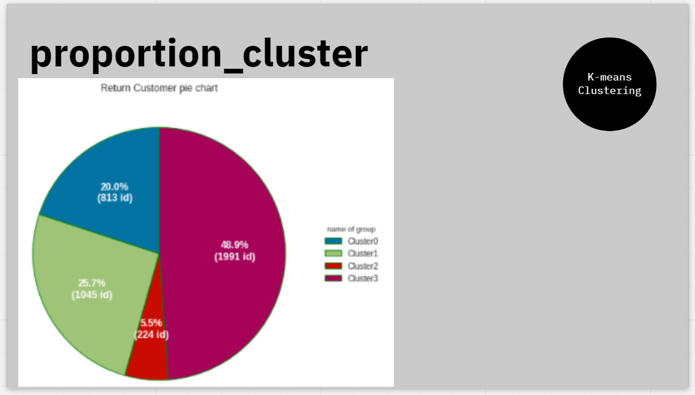  
  
  
  
  
## 7. ผลลัพธ์จากการแบ่งกลุ่มของลูกค้าประจำ     (ลูกค้าที่มีการใช้บริการตั้งแต่    2 ครั้งขึ้นไ ป) โดยใช้  K-means Clustering สรุปได้ดังนี้   
  
1. Cluster 0 : More Ticket size & More Engagement  
- จำนวนลูกค้า ~ 813 คน (~19.95% ของลูกค้าประจำ และ ~13.33% ของลูกค้าทั้งหมด)  
- รายรับจากลูกค้า (Total spend) ของกลุ่ม 0 เป็นลำดับที่ 3 ส่วนรายรับเฉลี่ยต่อคน (Ticket size) ของกลุ่ม 0 เป็นลำดับที่ 1  
- ลูกค้ามีระยะเวลา ~ 20.04 วันต่อ transaction (~ 1 เดือน)  
- ลูกค้ามาครั้งล่าสุด (Recency) เมื่อ ~ 17.18 วันก่อน (~ 0.5 เดือน) (ลำดับที่ 3)  
- ปริมาณที่ซื้อต่อครั้ง 13.58 ชิ้น (ลำดับที่ 2)  
- Total visit ~ 61.44 ครั้ง (ลำดับที่ 2)  
- time be member ~ 747.96 (ลำดับที่ 2)  
- conversion rate ~ 1.01 (ลำดับที่ 2)  
  
	จากข้อมูลข้างต้น สรุปได้ว่าลูกค้ากลุ่มที่ 0 เป็นกลุ่ม ลูกค้ากลุ่มนี้มียอดซื้อรวมสินค้าน้อยเป็นลำดับที่ 3  ปริมาณที่ซื้อต่อครั้งสูงเป็นลำดับที่ 2 ลูกค้ามาครั้งล่าสุดเมื่อ ~ 0.5 เดือนก่อน ระยะเวลาต่อ transaction ~ 20 วัน เมื่อประกอบกับ total visit และ time be member เป็นลำดับที่ 2 และมี conversin rate สูงเป็นลำดับที่ 2  
  
หน้าที่ของเราคือ เพิ่ม Engagement เพื่อสร้างความสัมพันธ์ที่ดีในระยะยาว ระหว่างแบรนด์และลูกค้า  
1.Influencer Marketing  
2.Daily promotional specials  
3.การให้ Coupons หลังการซื้อ โดยมีในระยะเวลาหมดอายุที่สั้นเพื่อกระตุ้นให้ลูกค้ากลับมาซื้อใหม่เร็วขึ้น ซื้อในปริมาณมากขึ้น  
4.ทดสอบการตลาดกับกลุ่มควบคุม เพื่อยืนยันว่าการเข้าชมบ่อยขึ้นจะส่งผลให้รายได้รวมสูงขึ้นหรือระดับรายได้ทั้งหมดไม่เปลี่ยนแปลงมากนัก (ความถี่สูงขึ้น, มูลค่าต่อ transaction ที่ต่ำลง)  
  
  
  
2. Cluster 1 : Bargain Hunter  
- จำนวนลูกค้า ~ 1,046 คน (~ 25.67 % ของลูกค้าประจำ และ ~ 17.15 % ของลูกค้าทั้งหมด)  
- รายรับจากลูกค้า (Total spend) น้อยที่สุด และรายรับเฉลี่ยต่อคน (Ticket size) เป็นลำดับที่ 3  
- ลูกค้ามีระยะเวลา ~ 42 วันต่อ transaction (~ 1.5 เดือน)  
- ลูกค้ามาครั้งล่าสุด (Recency) เมื่อ ~ 384 วันก่อน (~ 1 ปี 1 เดือน)(ลำดับที่ 4)  
- ปริมาณที่ซื้อต่อครั้ง ~ 6.94 ชิ้นต่อครั้ง (ลำดับที่ 3)  
- Total visit ~ 3.49 ครั้ง (ลำดับที่ 4)  
- time be member ~ 513.62 (ลำดับที่ 4)  
- conversion rate ~ 0.06 (ลำดับที่ 4)  
  
	จากข้อมูลข้างต้น สรุปได้ว่าลูกค้ากลุ่มที่ 1 ลูกค้ากลุ่มนี้เป็นกลุ่มที่มียอดการซื้อสินค้าต่ำที่สุด มีปริมาณซื้อที่สูงเป็นลำดับที่ 3 , ลูกค้ากลุ่มนี้มาครั้งล่าสุด ~ 1 ปี 1 เดือน เมื่อเทียบกับระยะเวลาต่อ transaction ~ 1.5 เดือน ซึ่งยังอยู่ในช่วงเวลาไม่ผิดปกติ , มี Total visit มากที่สุด, ลูกค้ากลุ่มนี้เป็นสมาชิก (Time be member) มานานสูงเป็นลำดับที่ 4 จากทั้ง 4 กลุ่ม และมี conversin rate ต่ำที่สุด พบว่าลูกค้าหายไปนานจนผิดปกติ มีความเป็นไปได้ว่าลูกค้าอาจไปซื้อสินค้าจากร้านอื่น หรือเป็นกลุ่มที่เข้ามาซื้อของเพื่อเอา Promotion เป็นพวก bargain hunter
  
หน้าที่ของเราคือ จัดการกลุ่ม bargain hunterและ ทำให้ลูกค้าที่ดีแต่ไปซื้อร้านอื่นกลับมา  
1.ทำ 2x2 matrix เพื่อจัดการกลุ่ม bargain hunter  
2.ให้ Coupon discount กลุ่มที่เป็นลูกค้าร้านอื่นเพื่อดึงมาซื้อร้าน  
3.ทำ Churn analysis ดูลูกค้าว่าไปเป็นลูกค้าร้านไหน คู่แข่งเป็นใคร อะไรเป็นสิ่งที่ดึงลูกค้าไป  
  
  
  
3. Cluster 2 : Upper Class  
- มีจำนวนลูกค้า ~ 224 คน (~5.50% ของลูกค้าประจำ และ ~3.67% ของลูกค้าทั้งหมด)  
- มีรายรับจากลูกค้า (Total spend) มากที่สุด และรายรับเฉลี่ยต่อคน (Ticket size) ของกลุ่ม 2 เป็นลำดับที่ 2  
- ลูกค้ามีมาในช่วงระยะเวลา ~ 4.62 วันต่อ transaction (ลำดับที่ 4)  
- ลูกค้ามาครั้งล่าสุด (Recency) เมื่อ ~ 4.26 วันก่อน (ลำดับที่ 4)  
- ปริมาณที่ซื้อต่อครั้ง ~ 14.02 ชิ้น (ลำดับที่ 1)  
- conversion rate ~ 3.60 (ลำดับที่ 1)  
  
	จากข้อมูลข้างต้น สรุปได้ว่าลูกค้ากลุ่มที่ 3 นี้เป็นลูกค้าชั้นดี (Upper Class) มี Brand loyalty ต่อร้านค้านี้สูงเห็นได้จาก ลูกค้ากลุ่มนี้ซื้อสินค้ามียอดที่สูง, ปริมาณซื้อที่สูง, ลูกค้ากลุ่มนี้มาที่ร้านครั้งล่าสุด ~ 5 วัน (recency ที่ต่ำ) เทียบกับระยะเวลาการซื้อสินค้าต่อ transaction ~ 5 วัน ซึ่งทั้งสองสอดคล้องกันไม่ผิดปกติมี Total visit มากที่สุด, ลูกค้าเป็นสมาชิก (Time be member) มาสูงที่สุดจากทั้ง 4 กลุ่มซึ่งเป็นผลดี และมี conversin rate สูงเป็นลำดับที่ 1  
  
หน้าที่ของเราคือต้องรักษาลูกค้ากลุ่มนี้เอาไว้ โดยใช้  
1.Loyalty Program ให้ลูกค้า ซื้อซ้ำ Retention โดยใช้ระบบสมัครสมาชิก, บัตรสะสมแต้ม, Promotion แลกรับของรางวัลหรือ กิจกรรมต่าง ๆ ที่ช่วยกระตุ้นให้เกิดการกลับมาซื้อสินค้าและบริการซ้ำ  
2.ทำ Up-selling เสนอขายสินค้าหรือบริการที่มีราคาสูงกว่าให้กับลูกค้าเพื่อเพิ่มยอดขาย  
  
  
  
4. Cluster 3 : Middle Class  
- จำนวนลูกค้า ~ 1,992 คน (~ 48.88% ของลูกค้าประจำ และ ~ 32.66% ของลูกค้าทั้งหมด)  
- รายรับจากลูกค้า (Total spend) ของกลุ่ม 3 สูงเป็นลำดับที่ 3 ส่วนรายรับเฉลี่ยต่อคน (Ticket size) ของกลุ่ม 3 น้อยที่สุด  
- ลูกค้ามีระยะเวลา ~ 111 วันต่อ transaction (~ 9.5 เดือน) (ลำดับที่ 1)  
- ลูกค้ามาที่ร้านครั้งล่าสุด (Recency) ~ 70 วันก่อน (ลำดับที่ 2)  
- ปริมาณที่ซื้อต่อครั้ง ~ 6.55 ชิ้นต่อครั้ง (ลำดับที่ 4)  
- Total visit ~ 8.71 ครั้ง (ลำดับที่ 3)  
- time be member ~ 628.06 (ลำดับที่ 3)  
- conversion rate ~ 0.14 (ลำดับที่ 3)  
  
	จากข้อมูลข้างต้น สรุปได้ว่าลูกค้ากลุ่มที่ 3 นี้มียอดซื้อรวมเป็นลำดับที่ 3 ปริมาณที่ซื้อต่อครั้งสูงเป็นลำดับที่ 4, ลูกค้ามาครั้งล่าสุดเมื่อ ~ 70 วันก่อน ระยะเวลาต่อ transaction ประมาณ ~ 9.5 เดือน พบว่าลูกค้าหายไปนานจนผิดปกติ มีความเป็นไปได้ว่าลูกค้าอาจไปซื้อสินค้าจากร้านอื่น หรือเป็นกลุ่มที่เข้ามาซื้อของเพื่อเอา Promotion เป็นพวก bargain hunter เมื่อประกอบกับ total visit และ time be member น้อยเป็นลำดับที่ 3  
  
หน้าที่ของเราคือ จัดการกลุ่ม Bargain hunter และ ทำให้ลูกค้าที่ดีแต่ไปซื้อร้านอื่นกลับมา Reactivate เนื่องจากกลุ่มนี้มีจำนวนที่มาก  
1.ทำ 2x2 matrix เพื่อจัดการกลุ่ม ฺBargain hunter  
2.ทำ Recommend additional products เพื่อใช้ทำ product association analysis  
3.Spend stretch discount คือ การซื้อสินค้าหนึ่งจะได้รับส่วนลดอีกสินค้าหนึ่ง  
  
  
  
  
# Case One visit customer  
## 3. Prepare Customer Single View**  
**Features**  
* `Total_visit` : total distinct transactions over all 'active' , representing *Frequency* in RFM analysis.  
* `TotalSpend` : total spending over all 'active', representing *Monetary* in RFM analysis.  
* `TotalSKUs` : SKU code identifies the exact product variant you are looking for., representing *Product*.  
* `LastDate` : duration in days from the last transaction, representing *Recency* in RFM analysis.  
* `FirstDate` : duration in days from the first transaction, representing *Tenure* in RFM analysis.  
* `ToTalQUANTITY` : total spending over all 'active', representing *Quantity*., representing *Quantity*.  
* `Ticket_size` : total spending over all transactions, representing *Monetary* in RFM analysis.  
* `recency` : the range from the last day that the customer arrived with the current day, representing *Recency* in RFM analysis.  
* `Total_days` : the ranges from the last day that the customer arrived and how far apart the last day the customer arrived., representing *Tenure*.  
* `'ToTalQUANTITY_TotalVisits'` : average quantity that a customer purchases each time, representing *Quantity*.  
* `'Totaldays_TotalVisits'` : the average customer days are derived from the total days that the customer arrives., representing *Tenure*.  
* `'Time_be_member'` : See how long this customer has been a customer., representing *Tenure*.  
* `'Conversion_rate'` : percentage of visitors to your channel that complete a desired goal (a conversion) out of the total number of visitors., representing *conversion*.  
* `'diff'` : diffenrence of 'ToTalQUANTITY_TotalVisits' and 'TotalSKUs_TotalVisits'., representing *Quantity*.  
  
  
  
## 4. Generate Customer Single View  
  
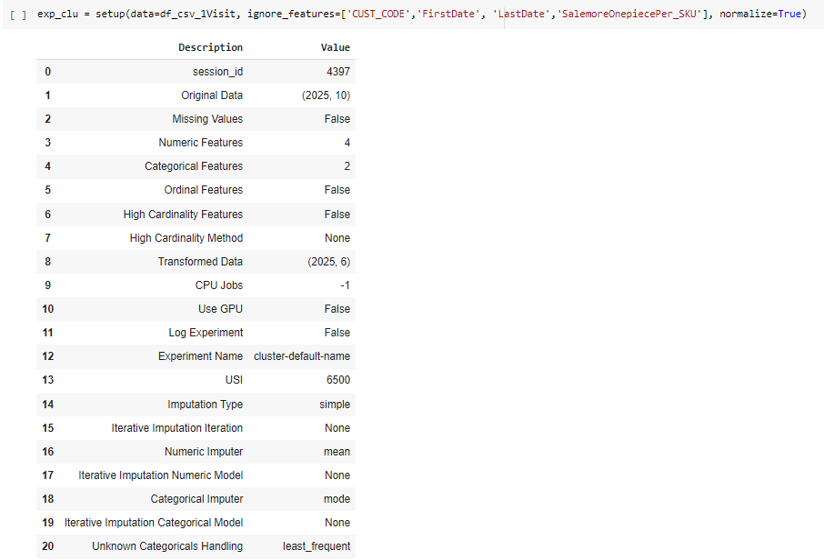  
  
  
  
## 5. Customer segmentation  
1. compare model performance  
From running to compare the models, it was found that the model with good performance was sc, ap and K-means.  
  
  
  
  
  
2. Use Spectral Clustering  
The first model to run was sc. After the Plot PCA Run sc model, there was no difference between the groups.  
**therefore choose to use Kmeans**  
  
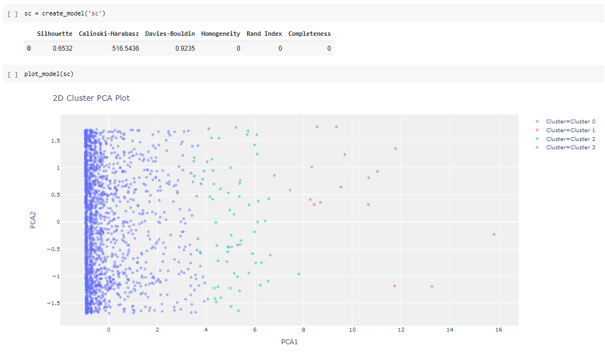  
  
  
  
3. Use KMeans Clustering  
The first model to run was Kmeans. After the Plot PCA Run kmeans model, it was found that the differences were clearly visible between the groups.  
  
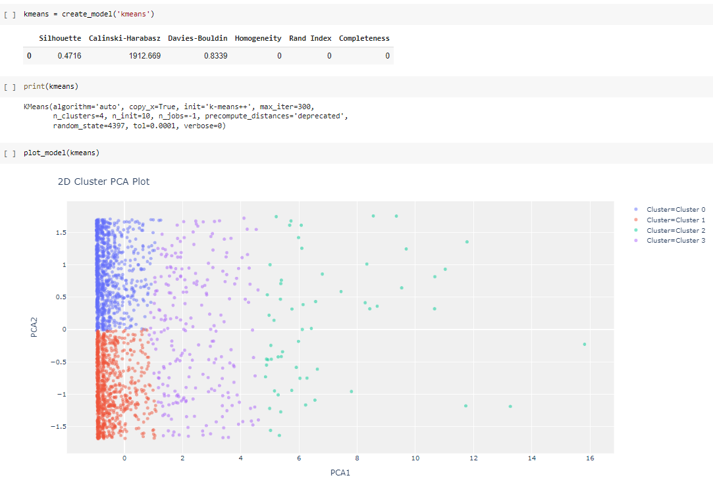  
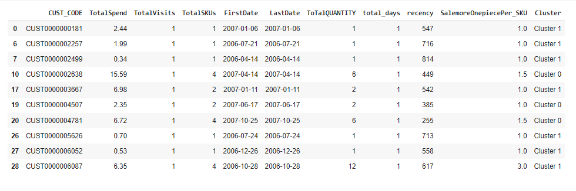  
  
  
**Elbow plot of Kmeans  and Silhouette plot of Kmeans**  
**Elbow plot of Kmeans**  
  
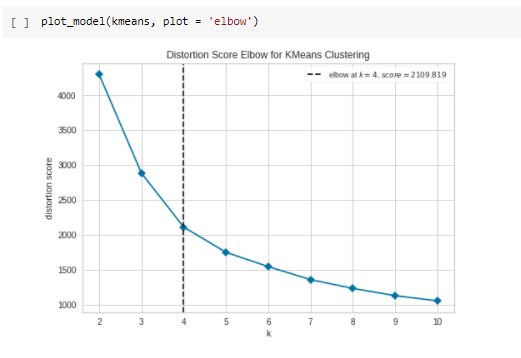  
  
  
  
**Silhouette plot of Kmeans**  
  
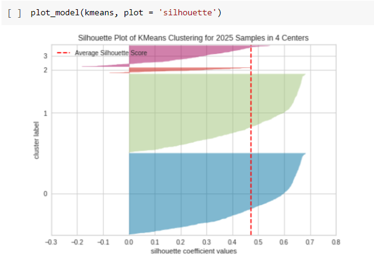  
  
  
  
## 6.Interpret results and plan for actions  
  
  
  
  
  
## 7.  ผลลัพธ์ของลูกค้าที่มาใช้บริการเพียง 1   1  ครั้งโดยใช้  K-means Clustering สรุปได้ดังนี้   
1. Cluster 0 : Invisible man  
- มีจำนวนลูกค้า ~ 853 คน (~42.14% ของลูกค้าที่เคยมาเพียง 1 ครั้ง และ ~13.99 % ของลูกค้าทั้งหมด)  
- มีรายรับจากลูกค้า (Total spend) ของกลุ่ม 0 ในระดับน้อย ( ~ 4.16 )  
- ความหลากหลายในการเลือกซื้อสินค้า (SKUs) น้อยอยู่ในระดับน้อย ( ~ 2 SKUs )  
- ปริมาณที่ซื้อต่อครั้งอยู่ในระดับน้อย ( ~ 3 ชิ้น )  
- ลูกค้ามาครั้งล่าสุด (Recency) เมื่อ ~ 650 วันก่อน  (~ 1 ปี 9 เดือน)  
  
	จากข้อมูลข้างต้น สรุปได้ว่าลูกค้ากลุ่มที่ 0 เป็นกลุ่ม ลูกค้าที่มียอดซื้อรวมสินค้าน้อย ปริมาณที่ซื้อต่อครั้งน้อย ซื้อสินค้าไม่หลากหลาย และมาใช้บริการเมื่อนานมากแล้ว  
  
หน้าที่ของเราคือ  
ไม่ทำอะไรเลย เพราะลูกค้าเป็นกลุ่ม Low Value และไม่ได้มาใช้บริการนานมากแล้ว อาจเป็นลูกค้าที่เเวะมาใช้บริการแค่ผ่านทาง  
  
  
  
2. Cluster 1 : Top invisible man  
- มีจำนวนลูกค้า ~ 882 คน (~43.58% ของลูกค้าที่เคยมาเพียง 1 ครั้ง และ ~14.46 % ของลูกค้าทั้งหมด)  
- มีรายรับจากลูกค้า (Total spend) ของกลุ่ม 1 น้อยที่สุด ( ~ 3.93 )  
- ความหลากหลายในการเลือกซื้อสินค้า (SKUs) น้อยอยู่ในระดับน้อย ( ~ 2 SKUs )  
- ปริมาณที่ซื้อต่อครั้งอยู่ในระดับน้อย ( ~ 3 ชิ้น )  
- ลูกค้ามาครั้งล่าสุด (Recency) เมื่อ ~ 268 วันก่อน ซึ่งน้อยที่สุด (~ 9 เดือน)  
  
	จากข้อมูลข้างต้น สรุปได้ว่าลูกค้ากลุ่มที่ 1 เป็นกลุ่ม ลูกค้ากลุ่มนี้มียอดซื้อรวมน้อย ปริมาณที่ซื้อต่อครั้งน้อย  ซื้อสินค้าไม่หลากหลาย แต่ระยะเวลาที่มาใช้บริการสั้นที่สุด และยังเป็นสัดส่วนส่วนของลูกค้าที่ค่อนข้างมาก จึงเป็นกลุ่มที่ควรจะทำให้มาเป็นลูกค้าประจำ  
  
หน้าที่ของเราคือ  
ต้องพยายามดึงมาเป็นลูกค้าประจำ เพราะลูกค้าเป็นกลุ่ม Low Value มีสัดส่วนถึง 14 % ของลูกค้าทั้งหมด และมาใช้บริการภายในปีนี้  
  
  
  
3. Cluster 2 : Middle invisible man  
- มีจำนวนลูกค้า ~ 230 คน (~11.36% ของลูกค้าที่เคยมาเพียง 1 ครั้ง และ ~3.77 % ของลูกค้าทั้งหมด)  
- มีรายรับจากลูกค้า (Total spend) ของกลุ่ม 2 อยู่ในอันดับที่ 2 ( ~ 27.58 )  
- ความหลากหลายในการเลือกซื้อสินค้า (SKUs) มากเป็นอันดับที่ 2 ( ~ 13.6 SKUs )  
- ปริมาณที่ซื้อต่อครั้งมากเป็นอันดับที่ 2 ( ~ 19 ชิ้น )  
- ลูกค้ามาครั้งล่าสุด (Recency) เมื่อ ~ 466 วันก่อน ซึ่ง (~ 1 ปี 3 เดือน)  
  
	จากข้อมูลข้างต้น สรุปได้ว่าลูกค้ากลุ่มที่ 2 ลูกค้ากลุ่มนี้มียอดซื้อรวม ปริมาณที่ซื้อต่อครั้ง และความหลากหลายในการซื้ออยู่ในระดับกลาง เป็นกลุ่มลูกค้าที่ซื้อสินค้าชนิดเดียวกันหลายชิ้น แต่ระยะเวลาที่มาใช้บริการล่าสุดมากที่สุด  
  
  
  
4. Cluster 3 : Need to win back  
- มีจำนวนลูกค้า ~ 59 คน (~ 2.92% ของลูกค้าที่เคยมาเพียง 1 ครั้ง และ ~ 0.97% ของลูกค้าทั้งหมด)  
- มีรายรับจากลูกค้า (Total spend)  มากที่สุด ( ~ 66.8 )  
- ความหลากหลายในการเลือกซื้อสินค้า (SKUs) มากที่สุด ( ~ 26.93 SKUs )  
- ปริมาณที่ซื้อต่อครั้งมากเป็นอันดับที่ 2 ( ~ 46.86 ชิ้น )  
- ลูกค้ามาครั้งล่าสุด (Recency) เมื่อ ~ 452 วันก่อน ซึ่ง (~ 1 ปี 3 เดือน)  
  
	จากข้อมูลข้างต้น สรุปได้ว่าลูกค้ากลุ่มที่ 3 นี้เป็นกลุ่ม upper-middle  ลูกค้ากลุ่มนี้มียอดซื้อรวม ปริมาณที่ซื้อต่อครั้ง และความหลากหลายในการซื้อมากที่สุด และอยู่ในระดับค่อนข้างสูง เป็นกลุ่มลูกค้าที่ซื้อสินค้าชนิดเดียวกันหลายชิ้นแต่ระยะเวลาที่มาใช้บริการล่าสุดค่อนข้างมากอาจเป็นลูกค้าที่มาซื้อในช่วงที่มีโปรโมชั่นลดราคาเยอะๆ อาจเป็นกลุ่มร้านค้า Retail  
  
หน้าที่ของเราคือ  
พยายามดึงมาเป็นลูกค้าประจำ เพราะลูกค้าเป็นกลุ่ม High Value แต่ไม่ใช่ลูกค้าที่มาใช้บริการบ่อยๆโดยทำการส่งโฆษณาโปรโมชั่นให้ลูกค้าในช่วงที่ร้านจัดกิจกรรม หรือมีสินค้าที่เคยซื้อจัดโปรโมชั่นให้ตรงกับความต้องการของลูกค้า  

 

