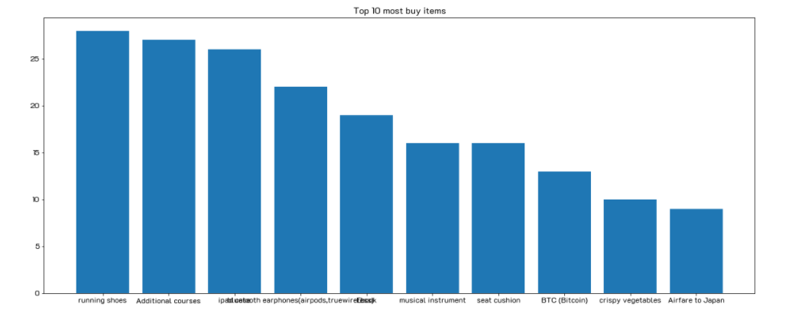
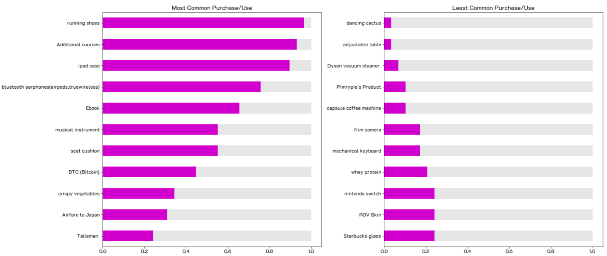
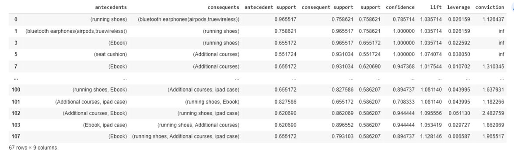
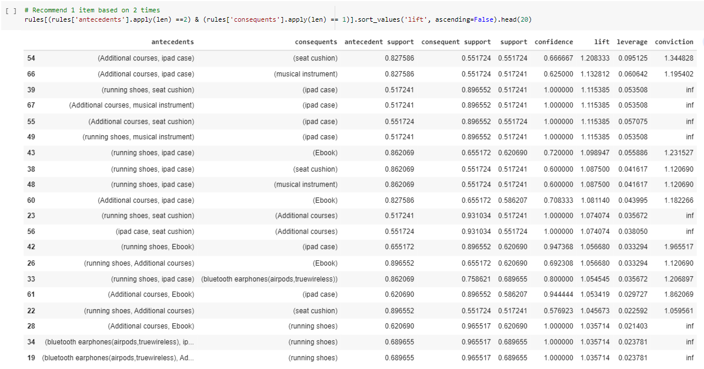
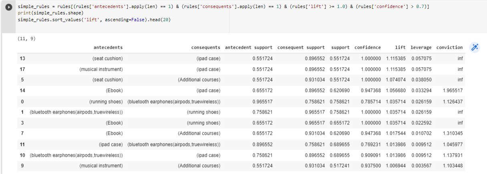
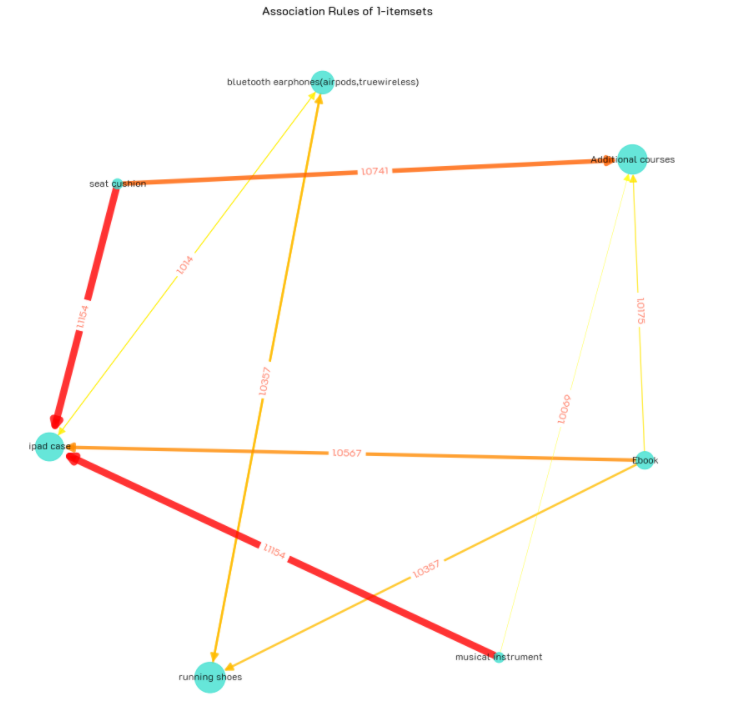
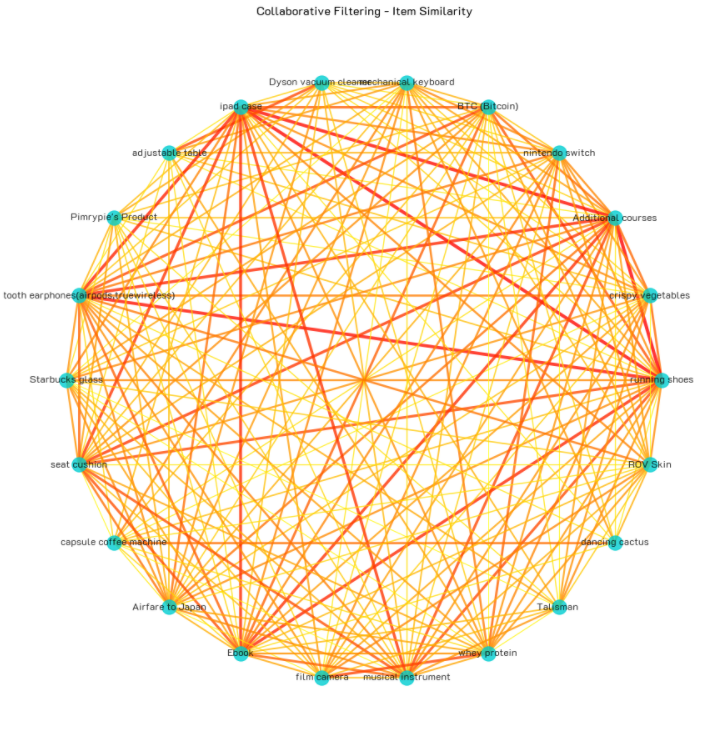
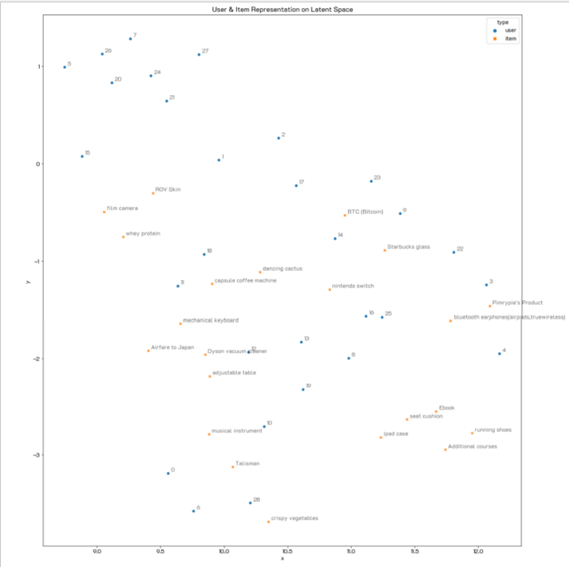
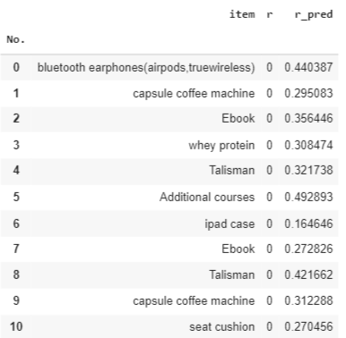

# Product Recommendation
       
  
**Notebooks:** [Product_Recommendation](./03_Product_Recommendation.ipynb)  
**Google Colab:**  
  
**Objective** :	the process of identifying products that appeal to individual users and presenting them at an opportune moment as a way of encouraging cross-selling and upselling. For most ecommerce businesses, product recommendations have now long been an integral aspect of their operations, increasing revenue and user engagement.  
**Technique** :	Association Rules, Collaborative Filtering, Matrix Factorization  
**Performance Measurement** : Human Evaluation  
  
## Dataset 
A survey asking whether or not the user (students from the class) has ever purchased/used an item. We received 30 responses, and each respondent rated each item from 27 items as Yes or No.  
 
## EDA
  
  
  
  
  
## Top Most and Least common items  
The results showed that the respondents had a score of used or never used on which items the most/least. where all score values are converted to a standard score (normalized) of zero to one.  
  
  
  
  
  
  
  
## Association Rules
Running a market basket analysis. Here's the visualzation of 1-itemset association rules (filtered by Support > 0.5 and Lift > 1.0).  
  
Apriori is a popular algorithm for extracting frequent itemsets with applications in association rule 
learning. The apriori algorithm has been designed to operate on databases containing transactions.  
  
**Step of Apriori Algorithm (mlxtend)**  
1. Prepare data  
2. Check missing data  
3. List unique item sold  
4. Cleansing **NONE** items  
5. Plot top 10 products  
6. Prepare data for Apriori using one-hot encoding  
7. Turn float into integer  
8. Determine product association using apriopi  
	Support is the probability that an item appears in all transactions.  Setting a small support score for the sake of taking out the ones that rarely happen. Therefore, only the rules that are of interest should be taken.  
9. List out rules  
	Nodes represent items and directed edges represent rules (antecedents ➞ consequents). Edge labels annotates Lift values. Note that for 1-to-1-itemset, both directions of rules (A➞B, B➞A) have the same lift values, so in the case, we always have bi-directional edges (A⬌B).  
  

  

  

  

  
  

## Collaborative Filtering - Item Similarity  
Use user ratings for each item as a feature vector. Calculate the cosine similarity for each pair of items. We can recommend items based on their similarity. Filters similarities using criteria 0.7 and visualizes them as graphs. The node represents the item. The edge thickness and color show the cosine similarity between the 2 items.    
  
  
  
  
  
## Matrix Factorization
Choosing to use NMF to decompose a utility matrix We get user and item mappings to ideas in the latent space. visualization in the same latent space as below Similar entries/users are close to each other.  
  
  
  
  
  
Reconstruct the decomposed matrices (user & item matrices) gives the predicted rating. In this case, recommendation can be made using the  item with the highest predicted rating score for each user.  
  
  
  
  
  
## Result
1. จากกราฟ Association rules มี ipad case เป็นตัวที่มี seat cushion กับ musical instument เป็นเส้นหนาวิ่งเข้าหามีโอกาสเป็นตัวตั้งต้นได้ จาก List of rules ที่น่าสนใจมีดังนี้
	-  **ipad case** เป็น antecedents มี antecedents support เท่ากับ 0.8966  คู่กับ **Ebook** เป็น consequents มี consequents support เท่ากับ 0.6552 มี lift กับ confidence ที่สูง การขาย Ebook
	crosssell กับ ipad case ก็มีความน่าสนใจ
	-  *Additional courses, ipad case* เป็น antecedents มี antecedents support เท่ากับ 0.8276  คู่กับ **seat cushion** 	เป็น consequents มี consequents support เท่ากับ 0.5517	มี lift กับ confidence ที่สูง การขาย *Additional courses, ipad case*	crosssell กับ ipad case ก็มีความน่าสนใจ  

2. จาก List of rules พบว่า  **running shoes** เป็น antecedents มี antecedents support เท่ากับ 0.9655 คู่กับ **bluetooth earphones(airpods,truewireless)** เป็น consequents มี consequents support เท่ากับ 0.7586 มี lift กับ confidence ที่สูง การขาย running shoes	crosssell กับ bluetooth earphones(airpods,truewireless คนที่ซื้อรองเท้าไปวิ่งก็อยากฟัง เพลง, Podcast, ข่าวสาร ฯ ซึ่งการขายคู่กันมี Promotion ให้ผู้ซื้อมีโอกาสขายได้สูง  
  
3. จาก List of rules พบว่า  **running shoes** เป็น antecedents มี antecedents support เท่ากับ 0.9655 คู่กับ **bluetooth earphones(airpods,truewireless), Additional courses** เป็น consequents มี consequents support เท่ากับ 0.6896 มี lift กับ confidence ที่สูง การขาย running shoes	crosssell กับ **bluetooth earphones(airpods,truewireless), Additional courses**  คนที่ซื้อรองเท้าไปวิ่งก็อยากฟัง เพลง, Podcast, ข่าวสาร ฯ และ คอร์สเรียน ซึ่งอาจจะเป็นเทคนิดการออกกำลังการอบ่างถูกต้อง ลดพุงรวดเร็ว เป็นต้น ซึ่งการขายคู่กันจัด Promotion ขายควบ เป็น bundle หรือ crossell เพื่อจูงใจลูกค้าได้
