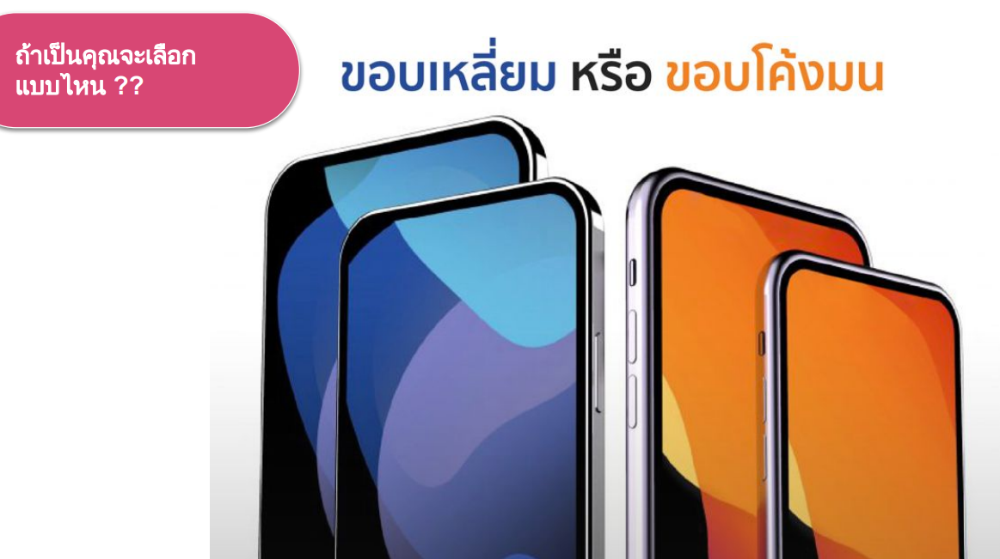
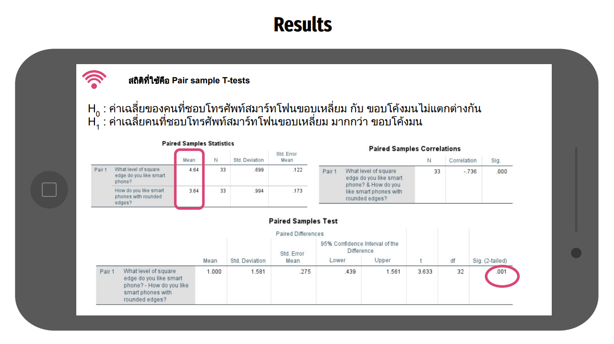
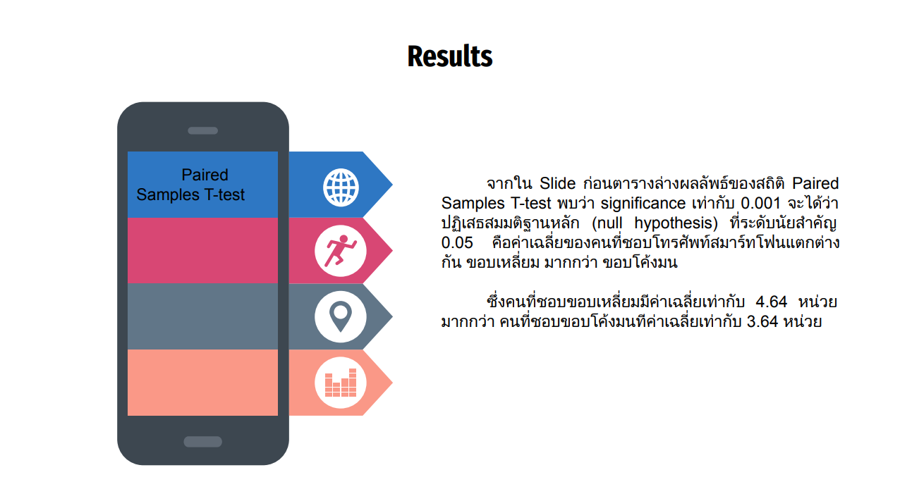
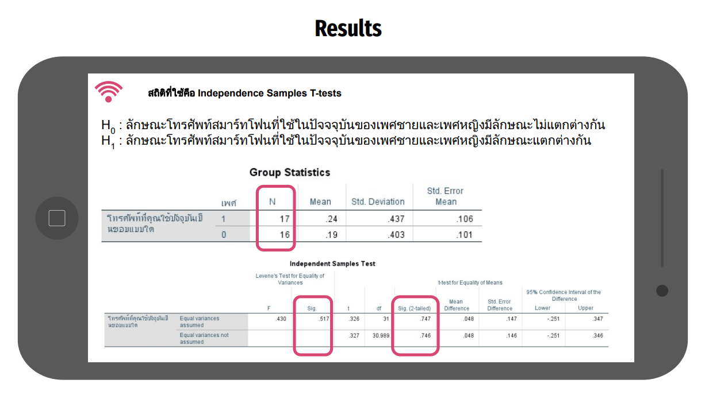
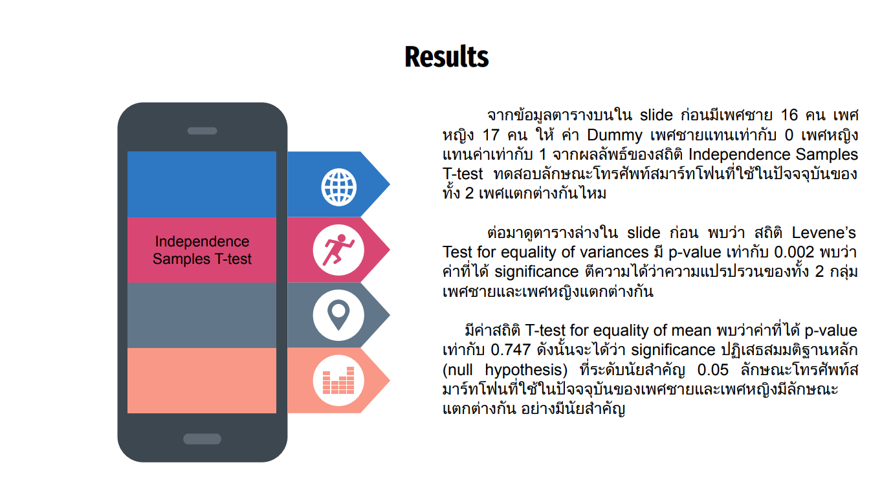
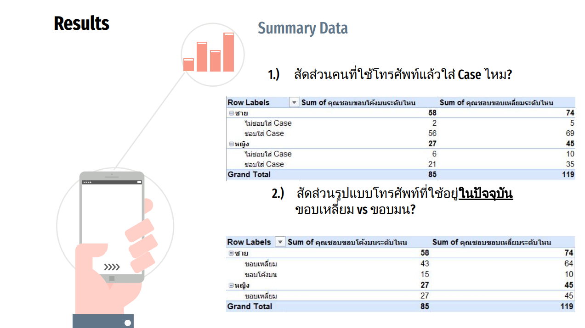
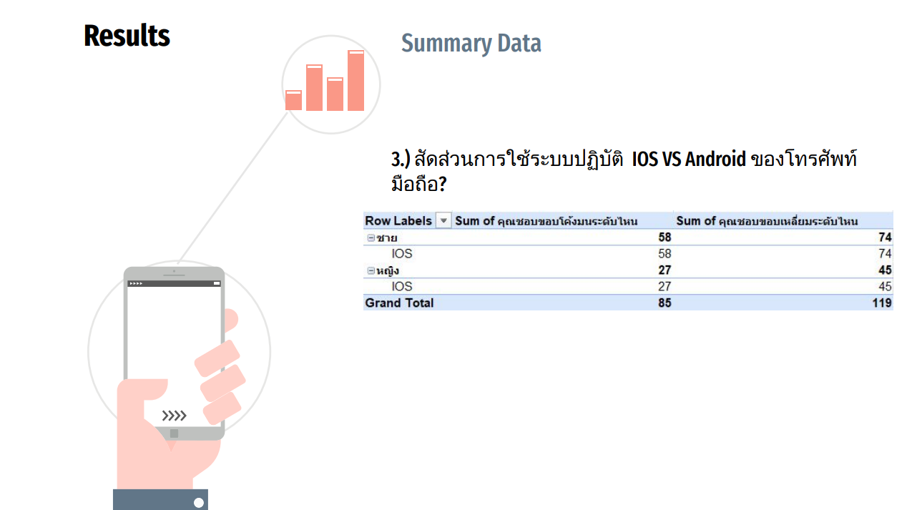

# A/B Testing
    

## Overview  
Conduct an A/B Testing by Survey method on surveying whether you prefer a smartphone with a rounded edge or a square edge.    
  
Since Apple released the iPhone 12, there has been much debate as iPhones revert to the square edge format. Some people like rounded edges. Hence the origin of this survey.    

## Dataset   
We prepared 2 types of Google Forms with exactly the same questions except the images of Pad-Kra-Prao with (A) or wihout (B) Long Beans.  
The dish image is displayed right at the question asking "How likely do you want to have this dish?" with a 7-scale response.  

## Result  
From the summary of survey data collection using  
1. Use Pair sample T-tests statistics to test the average of people who like smart phones with square edges and rounded edges, is there any difference?  
2. Use the Independence Samples T-tests statistics to test the average of the respondents. Is there a difference between male and female models of smartphones in use today?  

  