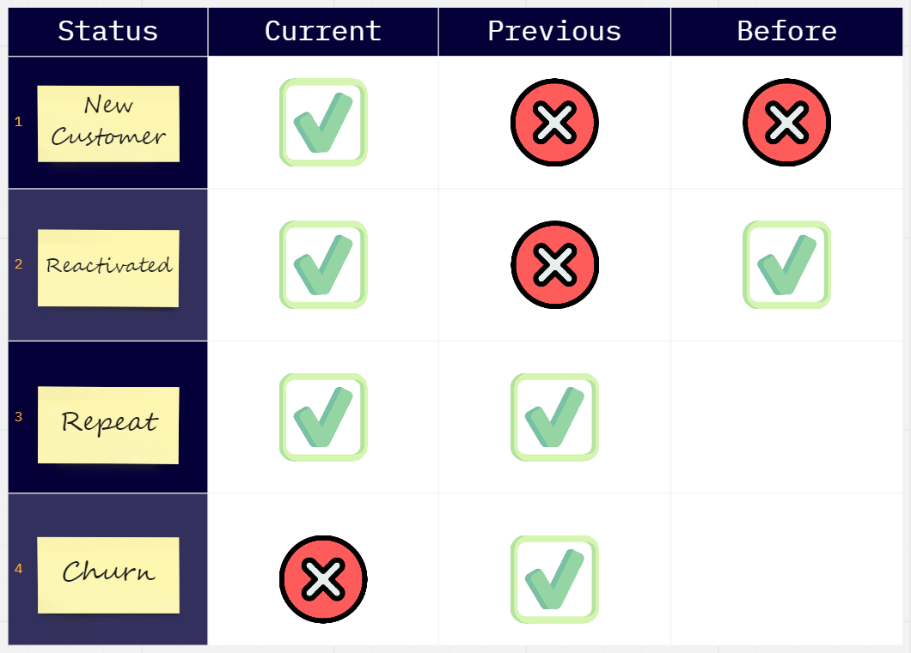
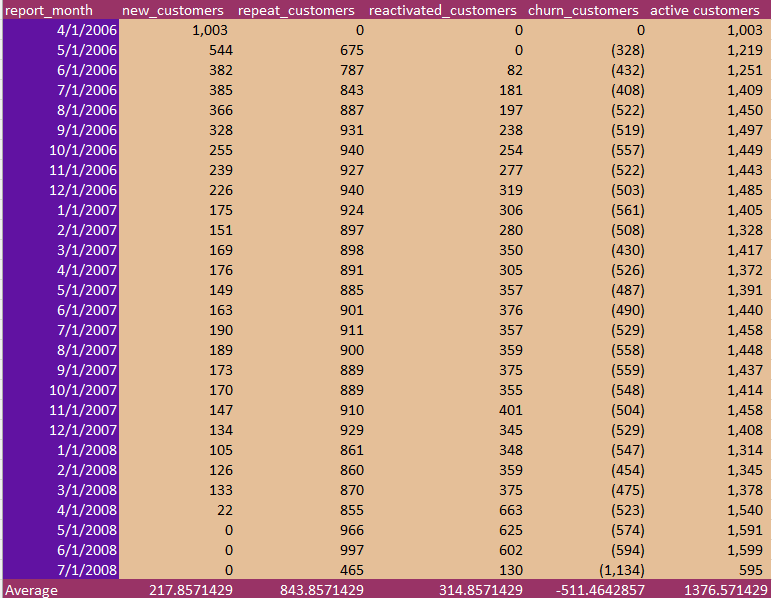
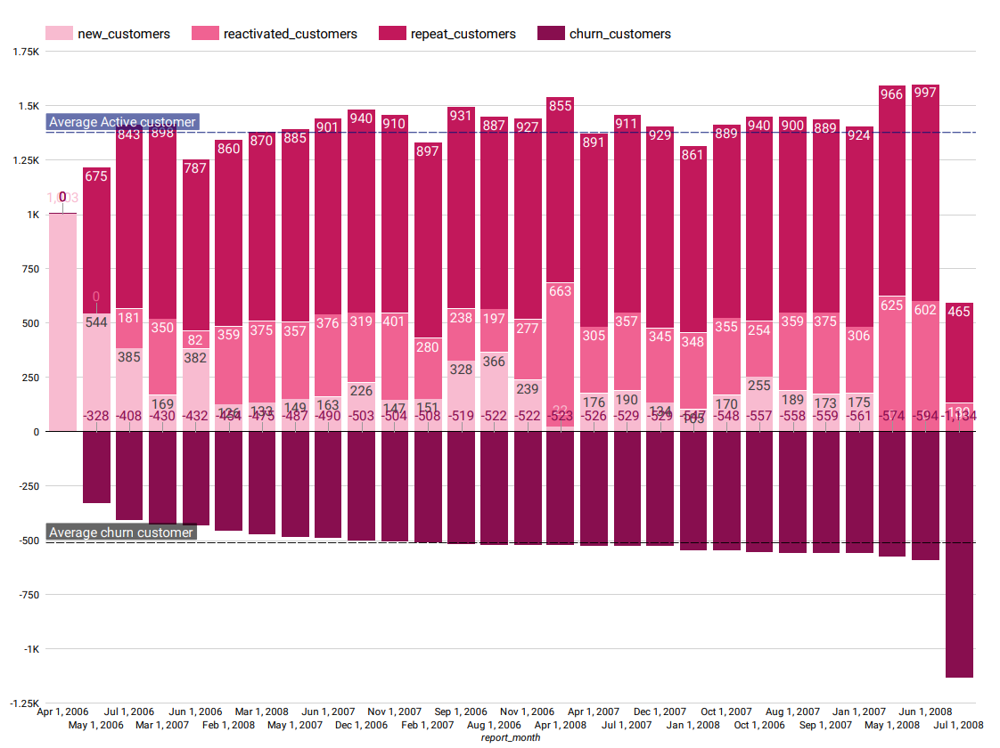

# Customer Movement Analysis
    
  
**Objective** :	Use the given data to help analyze the group of customers that come in over time. divided as follows 1.New Customer 2.Reactivated 3.Repeat 4.Churn  
**Technique** :	SQL (Query data), Google Data studio (Data Visualization)  
**Performance Measurement** :	Find the Problem , Find the Reason, Solve the problem by Find the Action  
  
Use the given data to help analyze the group of customers that come in over time. divided as follows    
1. New Customer    
2. Reactivated  
3. Repeat  
4. Churn  
  

  
**Current:** made purchases this month (M)  
**Previous:** made purchases last month (M-1)  
**Before:** made purchase before last month (< M-1)  
  
## Dataset 📊  
Supermarket data  contains 956K historical data from only 2 stores from 2006 to 2008.

## Data Preparation
After importing the Supermarket dataset into Google Bigquery, then run sql script to get the result for further data visualization.  
**SQL Result:**  
  

  
  
  
## Result
Data Visualization can be done immediately after running SQL on Google Bigquery using Google Data Studio.

