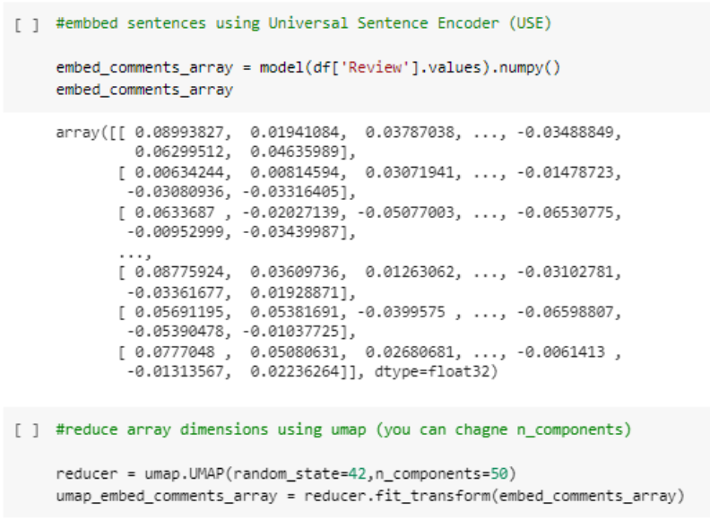
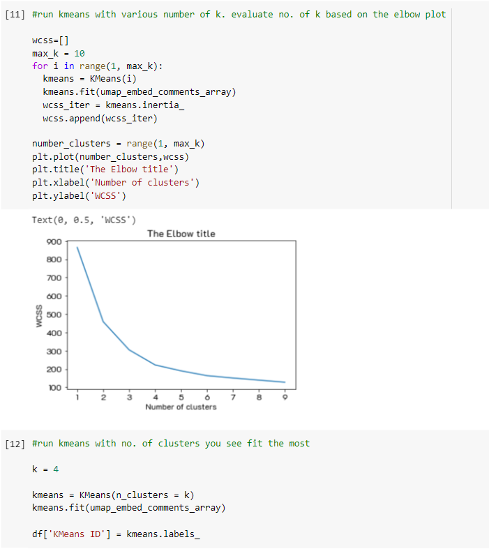
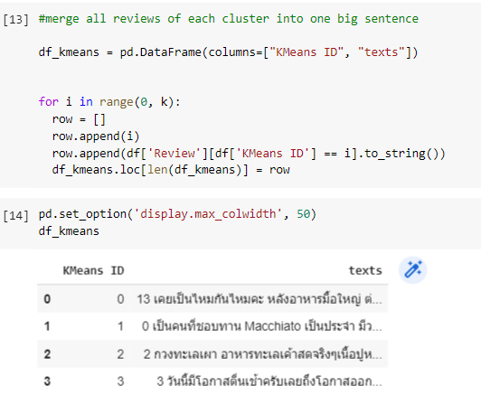
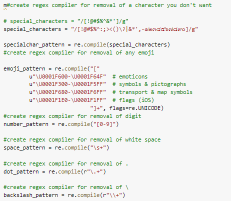
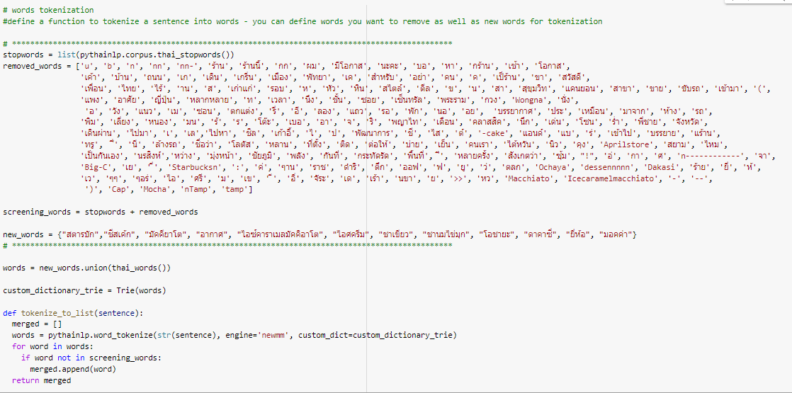
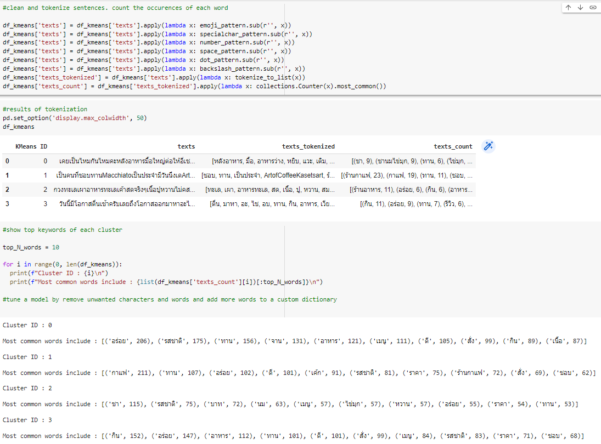
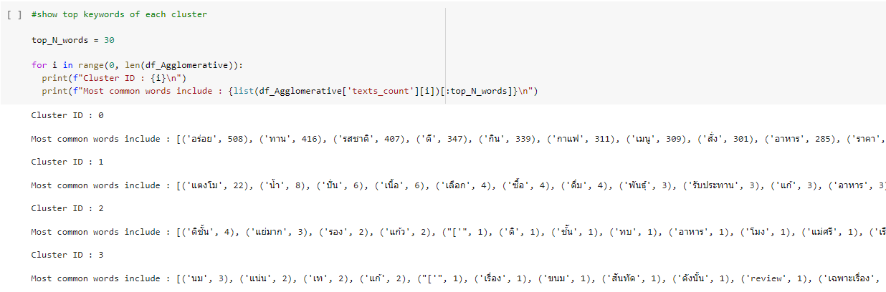
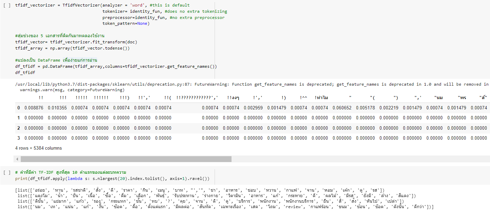
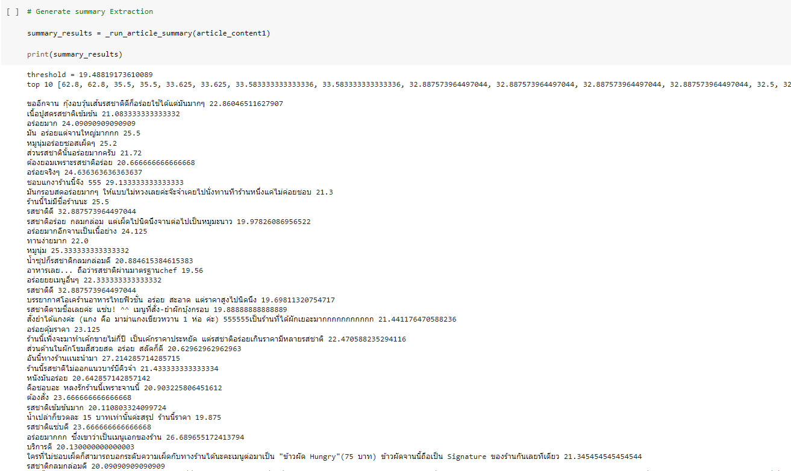

# Voice of Customers
     

## Dataset
Customer reviews of 3 restaurants from Wongnai Reviews - Small

**Notebooks:** [Voice of Customers](./07-Voice-of-Customers.ipynb)  
**Google Colab:**   
  
## Step Voice of customers
**1. Install and import library**  
**2. Load data "Wongnai Reviews - Small.csv" and module_url**  
**3. Document embedding and dimension reduction**  
  
  
  
  
  
**4. Document clustering using KMeans (number of Group K = 4)**  
  
  
  
  
  
  
**5. Text Preprocessing**  
   - Cleaning data (special characters, emoji, number, white space, dot, backslash)  
   - Stop words  
   - word tokenization   
   - Add new words
   - Text processing using KMeans Group  
     
     
  
       
 
    
  
  
  
**6. Try another document clustering using Agglomorative Clustering with cosine similarity.**  
  
 
 
 
 
 
**7. I did a search for keywords in each group of KMeans. Generate TF-IDF find importance word each document.**  
  
  
  
  
  
**8. Generate Text summary Extraction in 4 Group by TF-IDF (to summarize the document and keep it Semantic).**  
  
  
  
  
  
## Result  
#### 1. Group1 : Food taste critic  
Group 1 is a sentence about the taste of food. therefore think of this group as food taste critic   
Top 10 score text summary Extraction ▶ [62.8, 35.5, 33.625, 33.583333333333336, 33.583333333333336, 32.887573964497044, 29.23076923076923, 29.133333333333333, 28.8125, 28.0]  
  
1. ร้านนี้ = 62.8  
2. อร่อยดี = 35.5  
3. อาหารร้านนี้ผมเฉยๆ มาก = 33.625  
4. มีประมาณ 8 โต๊ะในร้าน 4 โต๊ะหน้าร้าน = 33.583333333333336  
5. รสชาติดี = 32.887573964497044  
6. อร่อยดีค่ะ = 32.5  
7. รสชาติจัดดี = 29.23076923076923  
8. ชอบแกงาร้านนี้จัง 555 = 29.133333333333333  
9. มีโต๊ะให้นั่งทั้งในและหน้าร้าน = 28.8125  
10. จานนี้สั่งซ้ำ = 28.0  
  
  
#### 2. Group2 : Coffee lover  
Group 2 is a sentence about coffee. So I think that this group is coffee lovers.    
Top 10 score text summary Extraction ▶ [54.285714285714285, 40.4, 36.142857142857146, 35.833333333333336, 35.69565217391305, 35.09090909090909, 34.89473684210526, 33.23076923076923, 32.388888888888886, 35.69565217391305]  
  
1. ร้านใหญ่ = 54.285714285714285  
2. ต้องร้านนี้ = 40.4  
3. ^^ร้านกาแฟ Twins bakery & Cuisine อยู่แถวๆ = 36.142857142857146  
4. ร้านสวยมาก = 35.833333333333336  
5. ถ้าพาคุณแม่มานั่งร้านกาแฟร้านนี้ = 35.69565217391305  
6. ร้านนี้เป็นร้านใหญ่ = 35.09090909090909  
7. กาแฟประจำร้านต้อง = 34.89473684210526  
8. ไม่เหมือนตามตู้เค้กร้านกาแฟ = 33.23076923076923  
9. ตกแต่งร้านสวยดี = 32.388888888888886  
10. ถ้าพาคุณแม่มานั่งร้านกาแฟร้านนี้ = 35.69565217391305  
  
  
#### 3. Group3 : Tea lover  
Group 2 is a sentence about tea. So I think that this group is tea lovers. 
Top 10 score text summary Extraction ▶ [48.742569730224055, 40.72727272727273, 35.81818181818182, 35.21052631578947, 29.714285714285715, 29.166666666666668, 29.0, 28.764705882352942, 28.727272727272727, 28.35, 28.333333333333332]  
  
1. ชานมไข่มุก = 48.742569730224055  
2. วันนี้ทานชานมไข่มุก = 40.72727272727273  
3. ชานมไข่มุกครับ = 35.81818181818182  
4. ชานมไข่มุกค่ะมีการทำขนมด้านในร้าน = 35.21052631578947  
5. รสชาติชานมไข่มุกร้านนี้ก็อร่อยไม่แพ้เจ้าไหนๆเลยครับ = 29.714285714285715  
6. ชาใช้ของ Twinnings = 29.166666666666668  
7. ชานมไข่มุกก็รสดีค่ะ = 28.764705882352942  
8. ชานมหอม = 28.727272727272727  
9. ร้านนี้มีรสชาติเฉพสะตัว = 28.35  
10. รสชาติดี = 28.333333333333332  
  
  
#### 4. Group4 : Traveler  
Group 1 is a sentence about recommending shops and places, so they think that this group is traveler.  
Top 10 score text summary Extraction ▶ [82.0, 60.0, 54.875, 54.25, 47.44444444444444, 44.75, 43.4, 43.0, 42.7, 38.333333333333336]  

1. ร้านนี้ = 82.0  
2. อิอิร้านนี้ = 60.0  
3. ด้านหน้าร้าน = 54.875  
4. ร้านน่ารัก = 54.25  
5. ร้านนี้ก็มีครบครัน = 47.44444444444444  
6. กินได้ = 44.75  
7. ไม่มีที่นั่งให้นั่งกินที่ร้าน = 43.4  
8. ร้านนี้แล้วกัน = 43.0  
9. ร้านค่อนข้างใหญ่โต = 42.7  
10. พูดดี = 38.333333333333336  
