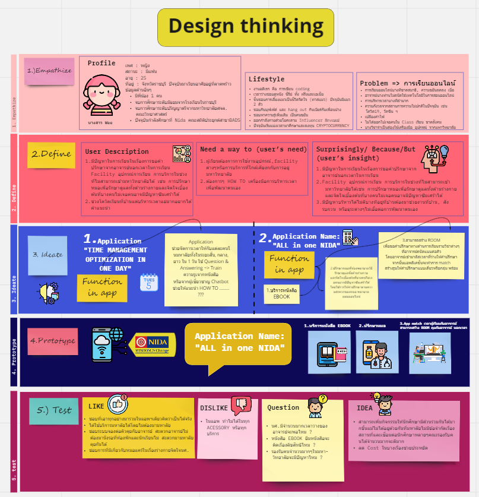
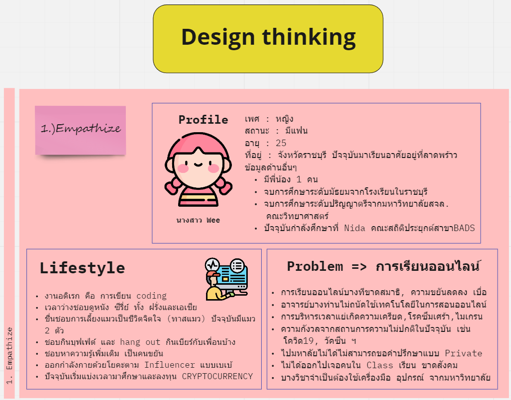
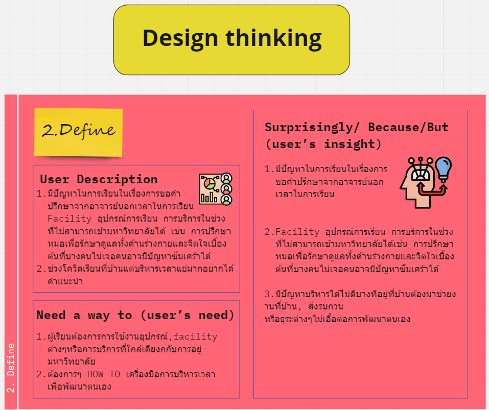
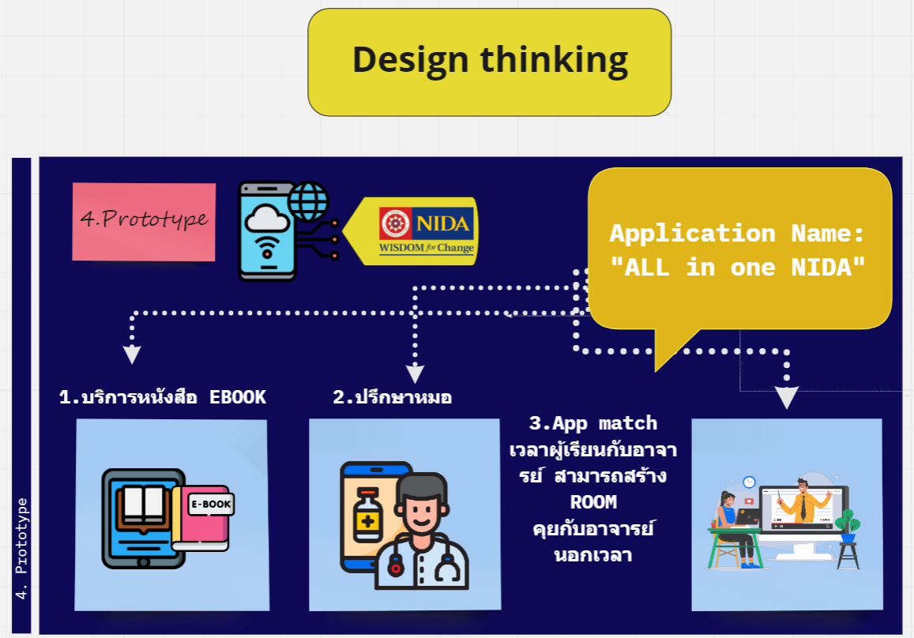
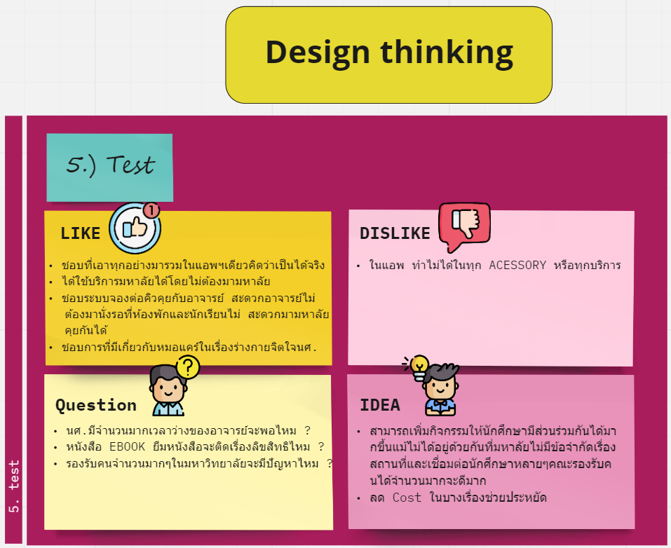

# Design Thinking
Product Application : "All in one NIDA" Application  
Design Thinking has five stage.  
1) Empathize  
2) Define  
3) Ideate  
4) Prototype  
5) Test  

## Design Thinking : "All in one NIDA" Application

## 1) Empathize

## 2) Define

## 3) Ideate

## 4) Prototype

## 5) Test
